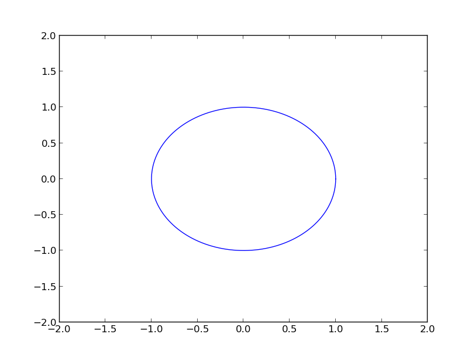
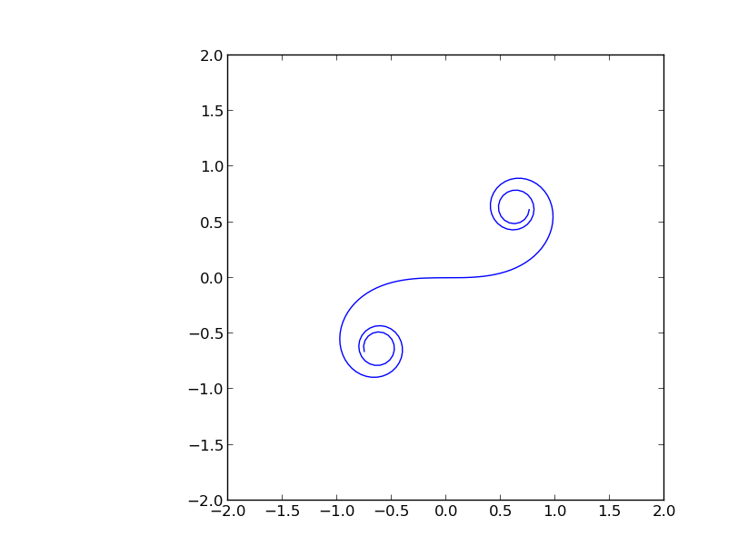
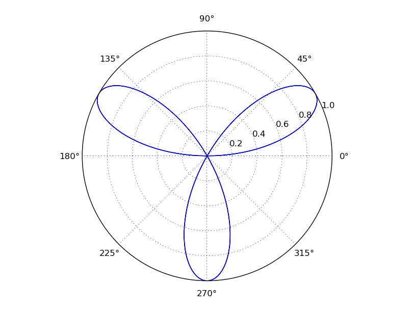

Plotting parametric and polar functions with Python
====================================================

It is pretty easy to plot beautiful looking graphs in python.
You have to use matplotlib. You can find matplotlib installation instructions
at their offical documentation.

`Matplotlib Installation <http://matplotlib.org/users/installing.html>`_

.. code-block:: python 

    import numpy as np
    import matplotlib.pyplot as plt
    
    # Define x coordinate in parametric form
    def x(t):
        return np.cos(t)
    
    # Define x coordinate in parametric form
    def y(t):
        return np.sin(t)
   
    #define the range of the parameter
    t = np.arange(0.0, 2*np.pi, 0.02)
    
    
    plt.plot(x(t),y(t), 'r--')

    # select the range of the axises
    plt.axis([-2,2,-2,2])

    plt.show()

Here is an Euler curve.

.. code-block:: python

    import numpy as np
    import matplotlib.pyplot as plt
    from sympy import *
    from sympy.mpmath import *

    def x(t):
        f = lambda x: cos(x*x) 
        g = lambda t: float(quad(f, [0, t]))
        return map(g, t)

    def y(t):
        f = lambda x: sin(x*x) 
        g = lambda t: float(quad(f, [0, t]))
        return map(g, t)

    t = np.arange(-3.8, 3.8, 0.05)

    plt.plot(x(t),y(t))
    plt.axis([-2,2,-2,2])
    plt.show()

.. code-block:: python

    import numpy as np
    import matplotlib.pyplot as plt
    
    def r(theta):
        return np.sin(3*theta)
    
    fig = plt.figure()
    ax = fig.add_axes([0.0, 0.1, 0.8, 0.8], polar=True)
    ax.set_rmax(1)
    
    theta = np.arange(0.0, 2*np.pi, 0.02)
    ax.plot(theta, r(theta))
    
    fig.show()
    plt.show()

    
.. author:: default
.. categories:: none
.. tags:: python, plotting 
.. comments::
