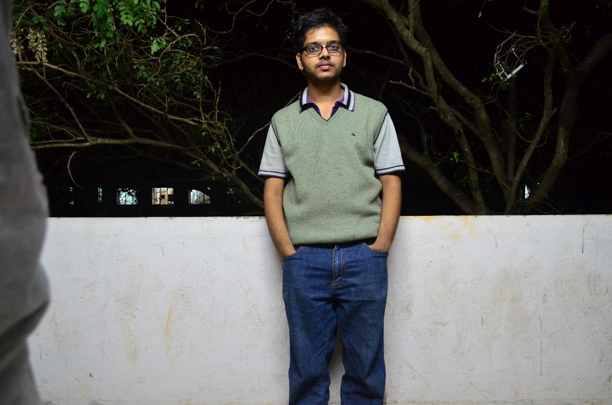
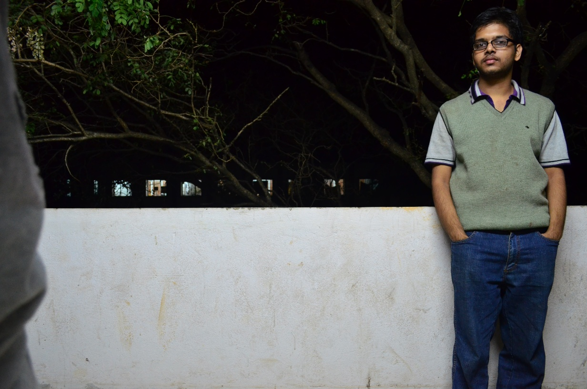
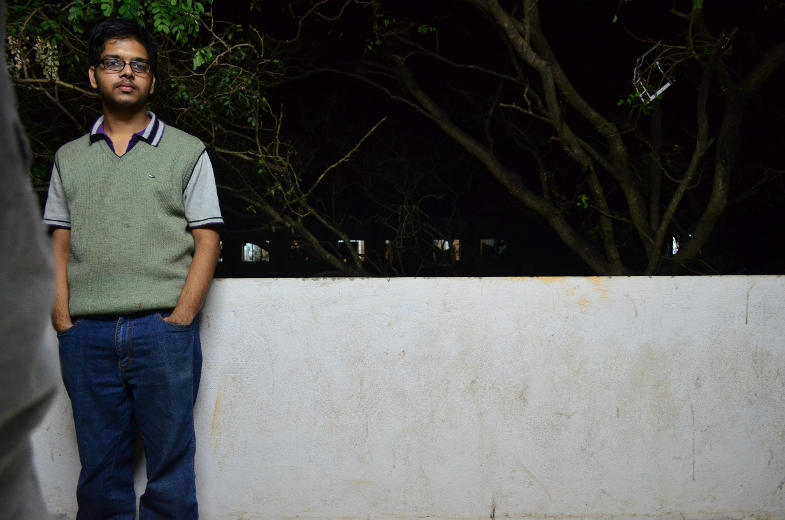
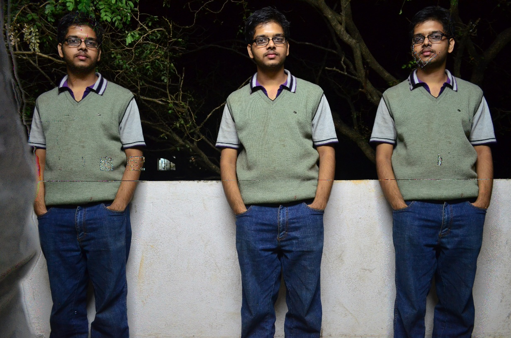

Create Your Twin Brothers
=========================

Here's how to create photos with 3 you.
Take 3 photos of you with same background
in different positions.
.. code-block:: python

    import cv2
    import numpy as np

    def far_away(a,b,c):
        A = int(a)
        B = int(b)
        C = int(c)

        if abs(A-B) < abs(B-C) and abs(A-B) < abs(A-C) :
            return c
        elif abs(C-B) < abs(A-C) and abs(C-B) < abs(A-B) :
            return a
        else :
            return b

    I = [None,None,None,None]
    I[1]= cv2.imread("Image1.jpg")
    I[2]= cv2.imread("Image2.jpg")
    I[3]= cv2.imread("Image3.jpg")

    rows = I[1].shape[0]
    cols = I[1].shape[1]
    res = np.zeros((rows,cols,3),np.uint8)

    for i in range(I[1].shape[0]):
        for j in range(I[1].shape[1]):
            for k in range(I[1].shape[2]):
                res[i][j][k] = far_away(I[1][i][j][k] , I[2][i][j][k] , I[3][i][j][k])

    cv2.imshow("result",res)
    cv2.imwrite("Merged.jpg",res)
    cv2.waitKey()

First Image

Second Image

Third Image

Result

Here for every pixel in the three images it
chooses the value of the RGB is with is farthest away from the other two.
Well you cannot do it easily with 2 images
because I don't see any naive way to distinguish between you and background
with only two images.

.. author:: default
.. categories:: none
.. tags:: none
.. comments::
