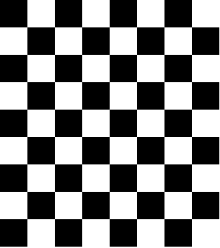
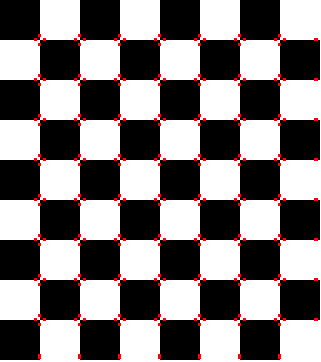

Harris Corner Detection
=======================

This is the implementation of the python implementation of the Harris corner
detection algorithm from the book *Feature Extraction and Image Processing* by
Mark Nixon and Alberto Aguado. The function is also available in opencv2 as `cv2.cornerHarris()`. I'm too lazy to explain the math now. Maybe next time.

.. code-block:: python

    import cv2
    import numpy as np

    def harris(img):

        rows, cols = img.shape

        Mx = cv2.Sobel(img, cv2.CV_32F, 0, 1,ksize=3 )
        My = cv2.Sobel(img, cv2.CV_32F, 1, 0,ksize=3 )

        edges = cv2.Canny(img, 50,100)
        M = np.zeros((rows, cols), dtype=np.float32)

        # computer gradient magnitude of with points that are local maximas
        for i in range(rows):
            for j in range(cols):
                if edges.item(i,j) > 0:
                    mag = np.sqrt(Mx.item(i, j)**2 + My.item(i, j)**2)
                    M.itemset((i, j), mag)

        w = 4 #Window size = 2*w + 1
        # k = 0.001
        k = 1

        outimg = np.zeros((rows, cols), np.uint8)
        for x in range(w,rows-w):
            for y in range(w, cols-w):

                if M.item(x, y) !=0:
                    A = 0
                    B = 0
                    C = 0

                    for i in range(-w, w+1):
                        for j in range(-w, w+1):
                            A += Mx.item(x+i, y+j)**2
                            B += My.item(x+i, y+j)**2
                            C += Mx.item(x+i, y+j)*My.item(x+i, y+j)

                    val = A*B - C**2 -k*(A+B)**2
                    print val
                    outimg.itemset((x,y), val)

        return outimg

    img = cv2.imread("./checkboard.png")
    gray = cv2.cvtColor(img, cv2.COLOR_BGR2GRAY)

    dst = harris(gray)

    dst = cv2.dilate(dst, None)

    img[dst>0.01*dst.max()]=[0,0,255]

    cv2.imwrite("checkboard_corner.png",img)
    cv2.imshow("img marked", img)
    cv2.waitKey(0)
    cv2.destroyAllWindows()

A checkboard

The checkboard with corners marked

.. author:: default
.. categories:: none
.. tags:: none
.. comments::
